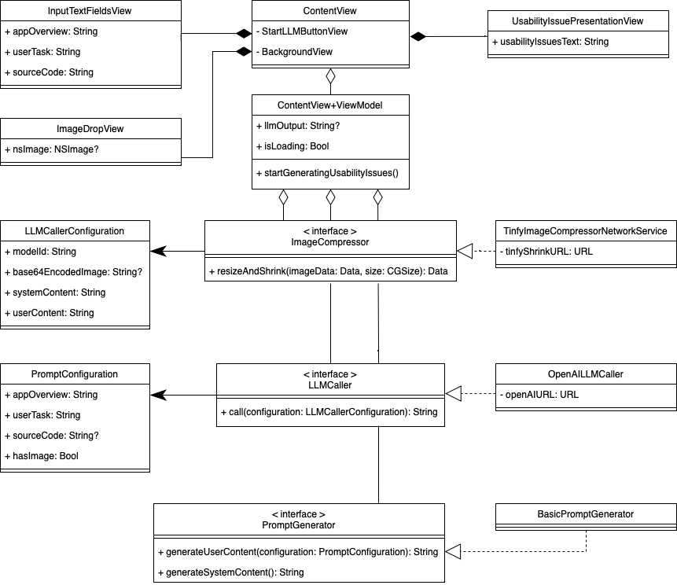

# UX-LLM


UX-LLM is a prototype application that predicts usability issues for a specific view of an iOS app. For instance, in the case of a simple registration view, UX-LLM might predict the lack for visual hints about the password's complexity requirements. 

UX-LLM takes three inputs: app context, source code, and an image of the view.    
The context description consists of two texts: a brief overview of the app, and the user's task, which describes the interaction within the analyzed view. For instance, when looking at a meditation app, the overview could be 'A meditation app focused on enhancing stress relief and wellness.' When analyzing the progress tracking view, the user's task could be 'reviewing their meditation history and achieved milestones.'
In addition, the source code provided needs to be SwiftUI code from the view components, its subviews and the view's logic. 
The inputted image can be a screenshot from the running app, Xcode's live preview, or from the design file.
This three inputs are packaged into a prompt and send to an LLM.
Finally, the output is a list of ten predicted usability issues with their rationale for the analyzed view.

## Usage
Just open the Xcode project, put in a ```openAIKey``` & ```tinyPNGkey``` into the ```LocalConfiguration``` file and start the Mac app.

## Implementation
UX-LLM is a macOS application written in SwiftUI. The current LLM implemented is the state-of-the-art GPT-4 Turbo with vision of OpenAI [^1]. For compressing images, TinyPNG's API is used [^2]. The shader animation while loading is from the project Inferno by twostraws [^3].

#### Prompt Engineering
The system role content:

```
You are a UI/UX expert for mobile apps. Your task is to identify 10 usability issues with the information you get for an app view.
Enumerate the problems identified; add an empty paragraph after each enumeration; no preceding or following text."
```

The user content:
```
var base = 
"""
I have an iOS app about: \(configuration.appOverview)
The users's task in this app view is about: \(configuration.userTask).
"""

if configuration.hasImage {
    base +=
    """
    A screenshot of the app view is provided.
    """
}
        
if let sourceCode = configuration.sourceCode {
    base += 
    """
    This is the swiftUI source code of the app view:
    \(sourceCode)
    """
}
```

[^1]: https://platform.openai.com/docs/models/gpt-4-and-gpt-4-turbo
[^2]: https://tinypng.com
[^3]: https://github.com/twostraws/Inferno

#### Architecture 

Below is a UML Class diagram of UX-LLM. It is simplified, especially when considering the implenentation of the SwiftUI MVVM architecture. The focus here is on the service layers of UX-LLM, which operate through interfaces and concrete implementations of them.



## License
 
The MIT License (MIT)

Copyright (c) 2023 MaibornWolff GmbH All rights reserved.

Permission is hereby granted, free of charge, to any person obtaining a copy of this software and associated documentation files (the "Software"), to deal in the Software without restriction, including without limitation the rights to use, copy, modify, merge, publish, distribute, sublicense, and/or sell copies of the Software, and to permit persons to whom the Software is furnished to do so, subject to the following conditions:

The above copyright notice and this permission notice shall be included in all copies or substantial portions of the Software.

THE SOFTWARE IS PROVIDED "AS IS", WITHOUT WARRANTY OF ANY KIND, EXPRESS OR IMPLIED, INCLUDING BUT NOT LIMITED TO THE WARRANTIES OF MERCHANTABILITY, FITNESS FOR A PARTICULAR PURPOSE AND NONINFRINGEMENT. IN NO EVENT SHALL THE AUTHORS OR COPYRIGHT HOLDERS BE LIABLE FOR ANY CLAIM, DAMAGES OR OTHER LIABILITY, WHETHER IN AN ACTION OF CONTRACT, TORT OR OTHERWISE, ARISING FROM, OUT OF OR IN CONNECTION WITH THE SOFTWARE OR THE USE OR OTHER DEALINGS IN THE SOFTWARE.
