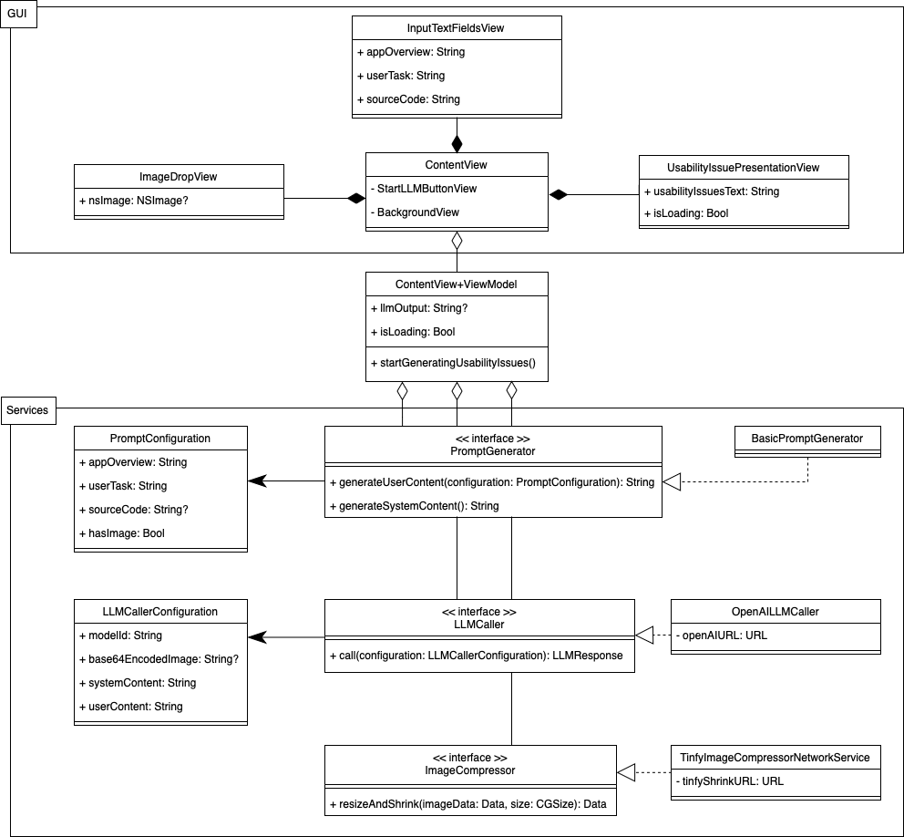

# UX-LLM

UX-LLM is a prototype application that predicts usability issues for a view of an iOS app. For instance, in the case of a simple registration view, UX-LLM might predict the lack for visual hints about the password's complexity requirements. 


UX-LLM takes three inputs: app context, source code, and an image of the view.    
The context description consists of two texts: a brief overview of the app, and the user's task, which describes the interaction within the analyzed view. For instance, when looking at a meditation app, the overview could be 'A meditation app focused on enhancing stress relief and wellness.' When analyzing the progress tracking view, the user's task could be 'reviewing their meditation history and achieved milestones.'
In addition, the source code provided needs to be SwiftUI code from the view's components and logic.
The inputted image can be a screenshot from the running app, Xcode's live preview, or from the design file.
This three inputs are packaged into a prompt and send to an LLM.
Finally, the output is a list of ten predicted usability issues with their rationale for the analyzed view.

## Usage
Open the Xcode project, put in a ```openAIKey``` & ```tinyPNGkey``` into the ```LocalConfiguration``` file and run the app.
Basic settings can be adjusted in the ```Constants``` file.

## Implementation
UX-LLM is a macOS application developed using SwiftUI. The incorporated LLM is the state-of-the-art GPT-4 Turbo with vision capabilities from OpenAI[^1]. For image compression, it uses TinyPNG's API[^2]. The shader animation during loading is sourced from the 'Inferno' project by twostraws[^3].

#### Prompt Engineering
OpenAI's API accepts a list of messages as input for the LLM. UX-LLM utilizes two types of messages: one for the system and another for user input. The system message provides high-level instructions on the model's expected behavior. Conversely, the user message is assembled using the information provided by the user about their app view. Generally, I've attempted to adopt Prompt Engineering methods from OpenAI's Documentation[^4], such as instructing the model to adopt a persona. However, there is room for improvement as this tool represents the first prototype.

System content:

```
You are a UI/UX expert for mobile apps. Your task is to identify 10 usability issues with the information you get for an app view.
Enumerate the problems identified; add an empty paragraph after each enumeration; no preceding or following text."
```

User content:
```
I have an iOS app about: [insert app overview text]
The users's task in this app view is about: [insert user task text].
The provided image is the visual representation of the app view.
The following is the SwiftUI source code for this view:
[insert source code]
```

[^1]: https://platform.openai.com/docs/models/gpt-4-and-gpt-4-turbo
[^2]: https://tinypng.com
[^3]: https://github.com/twostraws/Inferno
[^4]: https://platform.openai.com/docs/guides/prompt-engineering
[^5]: https://en.wikipedia.org/wiki/Bridge_pattern

#### Architecture 

Below is a simplified UML Class diagram of UX-LLM. The diagram particularly abstracts the complexity of the SwiftUI MVVM architecture by condensing the GUI layer and modeling combinations of views and their ```ViewModel```s as one. The primary focus is on the service layer of UX-LLM, which operates using the Bridge pattern[^5]. The three services ```PromptGenerator```, ```LLMCaller```, and ```ImageCompressor``` are abstracted from their actual implementation, allowing the system to vary independently from the concrete services it uses. This approach enables UX-LLM to easily adapt to different LLMs or services without significant changes to the system's core architecture. Additionally, the use of the Bridge pattern has simplified GUI testing by enabling the substitution of Mock objects for actual services.



## License
 
The MIT License (MIT)

Copyright (c) 2023 MaibornWolff GmbH All rights reserved.

Permission is hereby granted, free of charge, to any person obtaining a copy of this software and associated documentation files (the "Software"), to deal in the Software without restriction, including without limitation the rights to use, copy, modify, merge, publish, distribute, sublicense, and/or sell copies of the Software, and to permit persons to whom the Software is furnished to do so, subject to the following conditions:

The above copyright notice and this permission notice shall be included in all copies or substantial portions of the Software.

THE SOFTWARE IS PROVIDED "AS IS", WITHOUT WARRANTY OF ANY KIND, EXPRESS OR IMPLIED, INCLUDING BUT NOT LIMITED TO THE WARRANTIES OF MERCHANTABILITY, FITNESS FOR A PARTICULAR PURPOSE AND NONINFRINGEMENT. IN NO EVENT SHALL THE AUTHORS OR COPYRIGHT HOLDERS BE LIABLE FOR ANY CLAIM, DAMAGES OR OTHER LIABILITY, WHETHER IN AN ACTION OF CONTRACT, TORT OR OTHERWISE, ARISING FROM, OUT OF OR IN CONNECTION WITH THE SOFTWARE OR THE USE OR OTHER DEALINGS IN THE SOFTWARE.
